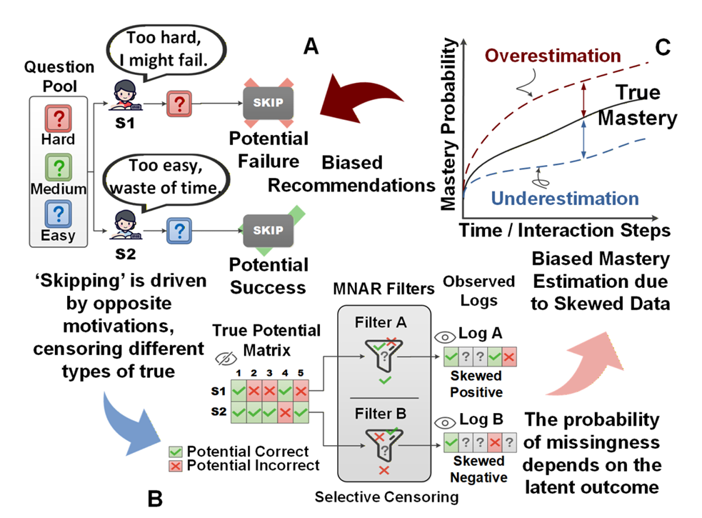

# TSDR
Official code for "Temporal Smoothness Doubly Robust Learning for Debiased Knowledge Tracing" (IJCAI 2026)


TSDR is a plug-and-play debiasing framework for Knowledge Tracing (KT). It is designed for educational logs that are selectively observed rather than randomly sampled. In real adaptive learning systems, exercise recommendation, student skipping, and self-selection can make the logged interactions Missing Not At Random (MNAR). Training KT models only on these observed logs may therefore mix true mastery with the data collection policy and produce biased knowledge-state estimates.



## Core Idea

TSDR reframes KT training as debiased risk estimation over the full space of potential student-concept interactions, not only the interactions that happen to be observed.

The framework contains three components:

- **KT predictor:** predicts the probability that a student answers the next question correctly from historical interactions.
- **Propensity model:** estimates the probability that a concept or item is observed under the current student state.
- **Imputation model:** estimates the counterfactual prediction error for unobserved interactions.

The doubly robust objective combines propensity-based correction with error imputation. It can remain unbiased if either the propensity model or the imputation model is accurate. However, directly applying doubly robust learning to sequential KT can introduce high variance and unstable training. TSDR therefore adds a **temporal smoothness regularizer** to the imputation trajectory, reducing variance accumulation while preserving the doubly robust correction.

## Features

- Supports multiple KT backbones: `DKT`, `AKT`, `simpleKT`, `FoLiBiKT`, `SparseKT`, and `DisKT`.
- Provides baseline, IPW-only, imputation-only, and doubly robust training modes.
- Adds temporal smoothness through the `--lambda` hyperparameter.
- Uses student-stratified cross-validation and reports AUC, ACC, and RMSE.

## Repository Structure

```text
TSDR/
  README.md
  main.py
  train.py
  data_loaders.py
  preprocess_data.py
  configs/
    example.yaml
  images/
    i.png
  models/
    __init__.py
    akt.py
    diskt.py
    dkt.py
    drkt.py
    folibikt.py
    simplekt.py
    sparsekt.py
  utils/
    __init__.py
    augment_seq.py
    config.py
    file_io.py
    utils.py
    visualizer.py
```

## Installation

Create a Python environment and install the main dependencies:

```bash
pip install torch numpy pandas scipy scikit-learn accelerate pyyaml tqdm
```

The exact PyTorch installation command may depend on your CUDA version. See the official PyTorch installation guide if GPU support is needed.

## Data

By default, datasets are expected under:

```text
./dataset/<data_name>/
```

The training script reads the dataset path from `configs/example.yaml`:

```yaml
dataset_path: "./dataset"
```

Each processed dataset should contain a `preprocessed_df.csv` file. If raw data are used, run or adapt `preprocess_data.py` for the corresponding dataset.

## Quick Start

Train a standard KT baseline:

```bash
python main.py --model_name akt --data_name prob --baseline
```

Train with the full TSDR objective:

```bash
python main.py --model_name akt --data_name prob --dr --lambda 0.3
```

Train with inverse propensity weighting only:

```bash
python main.py --model_name akt --data_name prob --ipw
```

Train with imputation only:

```bash
python main.py --model_name akt --data_name prob --imput
```

## Main Arguments

| Argument | Description |
| --- | --- |
| `--model_name` | KT backbone. Choices: `dkt`, `akt`, `simplekt`, `folibikt`, `sparsekt`, `diskt`. |
| `--data_name` | Dataset name under `./dataset`. |
| `--baseline` | Train the original backbone without debiasing. |
| `--ipw` | Use inverse propensity weighting. |
| `--imput` | Use the imputation model without IPW correction. |
| `--dr` | Use doubly robust learning. |
| `--lambda` | Temporal smoothness strength. |
| `--dropout` | Dropout probability. |
| `--batch_size` | Training and evaluation batch size. |
| `--embedding_size` | Embedding size for supported backbones. |
| `--lr` | Learning rate. |
| `--optimizer` | Optimizer name. |
| `--mode` | Optional experiment mode for controlled settings. |

The training-mode flags `--baseline`, `--ipw`, `--imput`, and `--dr` are mutually exclusive. If none is specified, the script defaults to baseline training.

## Supported Backbones

The current implementation supports:

- `dkt`
- `akt`
- `simplekt`
- `folibikt`
- `sparsekt`
- `diskt`

TSDR wraps these backbones during training. The additional propensity and imputation modules are used for debiased offline training, while online inference can still use the KT predictor.

## Code Credits

Part of this codebase is adapted from and extended upon [DisKT](https://github.com/zyy-2001/DisKT). We thank the original authors for their open-source contribution.
